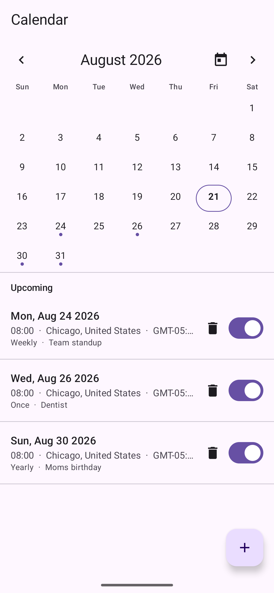
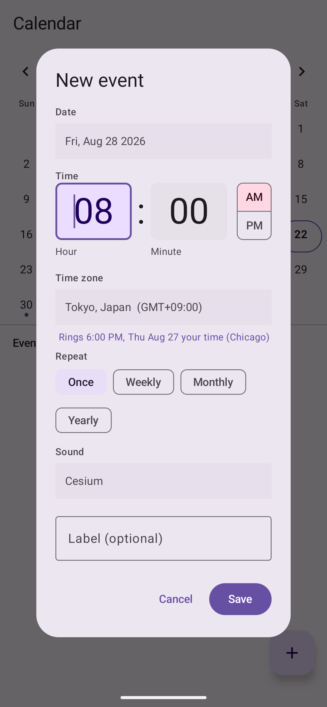

# BasicCalendar

A minimal **date and time-zone alarm calendar**: set an alarm for a specific future date and time in any city's zone, with optional weekly / monthly / yearly repeats, fully offline.

> Part of the [Basic Apps suite](../README.md). No `INTERNET` permission, so nothing you schedule leaves the device.

## Screenshots

| Month grid & upcoming | New event |
|---|---|
|  |  |

> Demo events, captured on an emulator.

## Features

- **Month grid + event list**: a tappable month calendar with today ringed, the selected day highlighted, and a dot on days that have an alarm; the list below shows that day's events, or all upcoming events sorted by which fires next
- **Date + time in a chosen time zone**: an event is anchored to a real calendar date and wall-clock time *in* a picked region, so it rings at the correct absolute moment across DST and even if the phone travels to another zone
- **Repeats**: once, weekly, monthly, or yearly; a one-off switches itself off after ringing, repeats re-arm their next occurrence
- **Reminder lead time**: ring at the event, or 30 or 60 minutes before it, for a heads-up ahead of time (repeats keep the same lead each occurrence); or **None** for a silent calendar entry that shows on the date but arms no alarm or notification
- **Full-screen ring** over the lock screen with Snooze and Dismiss, plus a per-event ringtone picker
- **Survives reboot, clock, and time-zone changes**: alarms are re-armed on `BOOT_COMPLETED`, `TIME_SET`, and `TIMEZONE_CHANGED`, and re-checked each time the app opens

## Notable implementation

- Recurrence resolves through a small `java.time` engine (`CalendarEvent.nextTrigger`) that searches forward for the next valid instant; repeats skip dates the calendar doesn't have (a monthly-on-the-31st only fires in 31-day months, a yearly Feb-29 only in leap years) rather than sliding onto a day you didn't pick
- Rings via `AlarmManager.setAlarmClock`: exact and Doze-exempt, shows the status-bar alarm icon, and needs no `SCHEDULE_EXACT_ALARM` prompt (`USE_EXACT_ALARM` is auto-granted)
- A foreground media-playback service produces the looping alarm sound and vibration itself, so the event is still heard when Android downgrades the full-screen intent to a heads-up notification (14+ without full-screen-intent access)
- Events persist as hand-encoded JSON in private `SharedPreferences`, no database, no dependencies
- Fully offline by design: the missing `INTERNET` permission is the privacy guarantee

## Requirements

`minSdk 26`. Permissions: `POST_NOTIFICATIONS` (13+), `USE_EXACT_ALARM`, `USE_FULL_SCREEN_INTENT`, `RECEIVE_BOOT_COMPLETED`, `VIBRATE`, `FOREGROUND_SERVICE` / `FOREGROUND_SERVICE_MEDIA_PLAYBACK`. **No `INTERNET`.**
