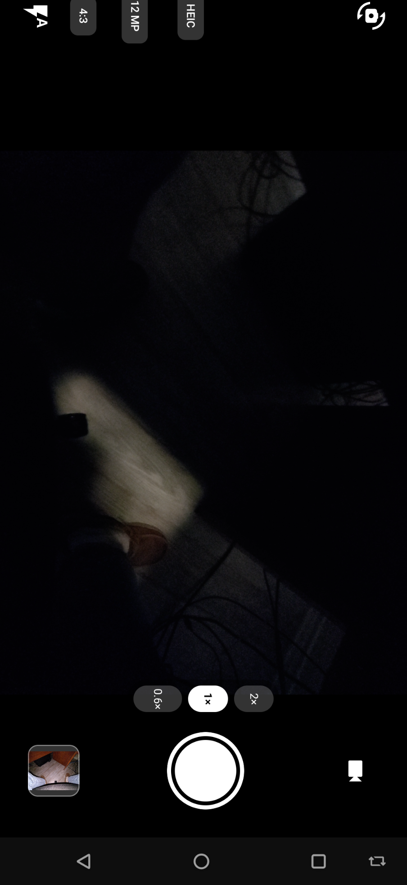

# BasicCamera

A minimal **camera app** built on CameraX, photo, video, and HEIC, fully offline.

> Part of the [Basic Apps suite](../README.md). No `INTERNET` permission, your photos never leave the device.

## Screenshots

| Viewfinder |
|---|
|  |

## Features

- **Photo & video** with front/back switching and multi-lens selection
- **HEIC capture** (`androidx.heifwriter`) as a toggle vs. JPEG, for smaller high-quality photos
- **Aspect ratio** (4:3 / 16:9) and a **resolution / quality** picker (favoring maximum quality)
- **Pinch-to-zoom** with zoom presets and an on-screen indicator, tap-to-focus, flash
- **Volume-button shutter** for one-handed capture
- **Landscape UI rotation**, EXIF-location stripping, and open-in-gallery

## Notable implementation

- `LifecycleCameraController` with `ResolutionSelector` / Camera2 interop
- Honestly surfaces device/HAL limits (e.g. a hardware-capped zoom range) rather than faking capability
- API-guarded capture paths across Android 10-15

## Requirements

`minSdk 29` (Android 10). This is the one app in the suite that needs Android 10 rather than 8, for its HEIC encoder and CameraX video pipeline, so it will **not install on older devices** such as the HTC 10 (Android 8). Permissions: `CAMERA`, `RECORD_AUDIO` (for video).
