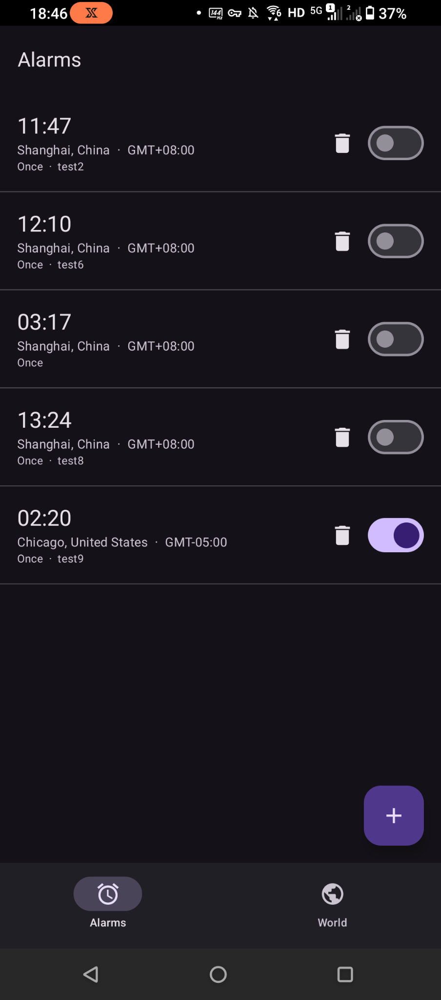
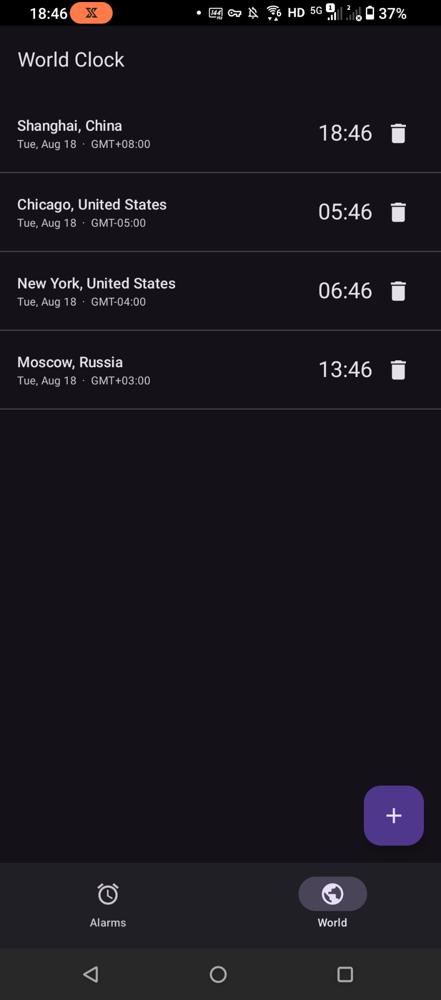
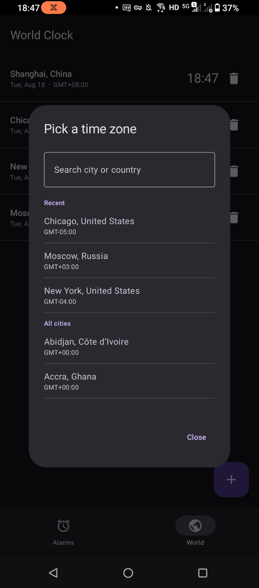
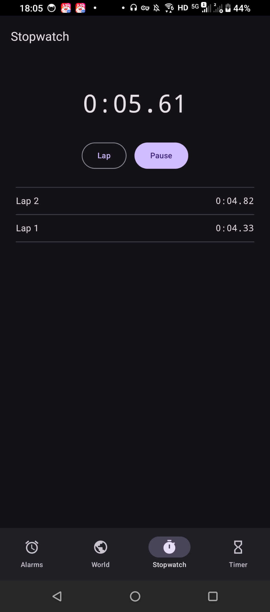
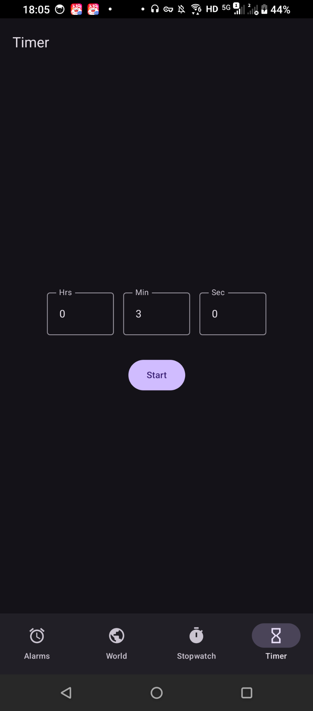
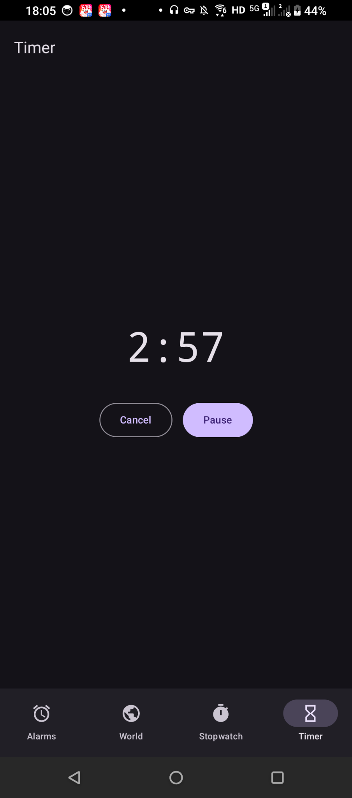

# BasicClock

A minimal **clock** app (time-zone-anchored alarms, world clock, stopwatch, and timer), fully offline.

> Part of the [Basic Apps suite](../README.md). No `INTERNET` permission.

## Screenshots

| Alarms | World clock | Time-zone picker |
|---|---|---|
|  |  |  |

| Stopwatch | Timer | Running timer |
|---|---|---|
|  |  |  |

## Features

- **Time-zone-anchored alarms**: set "9:00 AM New York time" and it rings at the correct *local* moment, staying right across DST changes and even if the phone travels to another zone
- **Full editor**: Material time picker, a **searchable time-zone picker** with a **Recent** list and city + country labels, repeat-day chips, a **ringtone picker**, and a label
- **Reliable ringing**: a foreground service plays the looping alarm sound + vibration behind a full-screen notification, so it's heard even when Android downgrades the full-screen intent to a heads-up
- **Dismiss / Snooze**, and a **World Clock** tab with live times, GMT offsets, and country names
- **Stopwatch**: start / pause, lap splits, and reset at centisecond precision; keeps running when you switch tabs
- **Timer**: set hours / minutes / seconds and count down, with pause / resume / cancel; it rings even when the app is closed, reusing the alarm's full-screen ring

## Notable implementation

- Fires via `AlarmManager.setAlarmClock()`: exact, Doze-exempt, needs no `SCHEDULE_EXACT_ALARM` (uses `USE_EXACT_ALARM`, the alarm-app permission)
- Next fire time is computed as an **`Instant` from the target `ZonedDateTime`**, which is what makes it DST- and travel-correct
- Re-arms on boot / clock / time-zone change, **and on app open** (self-heal against OEM force-stops that cancel pending alarms)
- Persists a handful of alarms as JSON in SharedPreferences, no database, near-zero idle footprint
- The **timer reuses the alarm's exact-schedule + foreground-ring path**, so it fires reliably in the background with no extra permissions; the **stopwatch derives elapsed time from `elapsedRealtime()` marks** (not a ticker), so it stays accurate regardless of UI redraws

## Requirements

`minSdk 26`. Permissions: `USE_EXACT_ALARM`, `USE_FULL_SCREEN_INTENT`, `FOREGROUND_SERVICE(_MEDIA_PLAYBACK)`, `RECEIVE_BOOT_COMPLETED`, `VIBRATE`, `POST_NOTIFICATIONS` (13+). On Android 14+, grant **full-screen intents** so alarms take over the screen.
