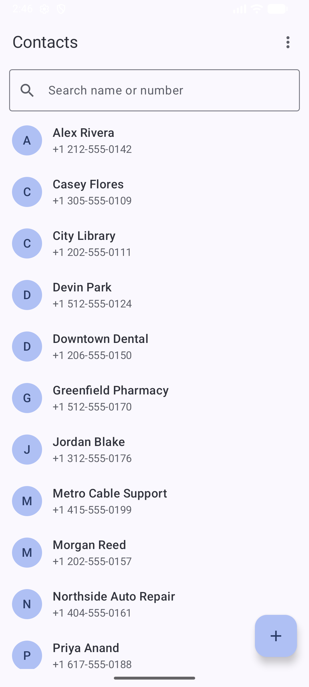
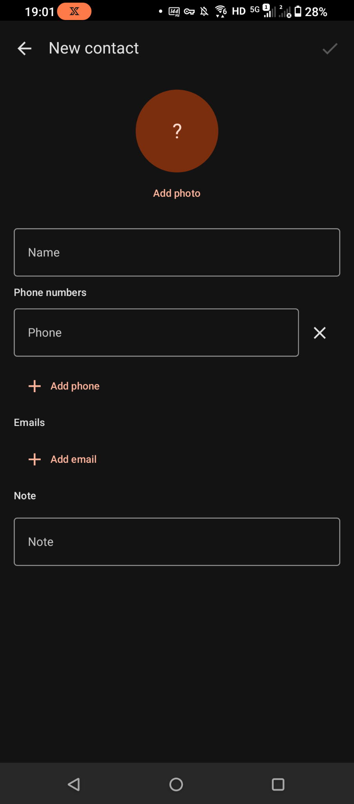

# BasicContacts

A minimal **contacts manager** over `ContactsContract`, with vCard import/export, fully offline.

> Part of the [Basic Apps suite](../README.md). No `INTERNET` permission.

## Screenshots

| Contacts | New contact |
|---|---|
|  |  |

> Demo data, fictional 555-01xx contacts, captured on an emulator.

## Features

- **Contact list, detail, and edit** screens with photos
- Quick actions from a contact: call, text, email
- **vCard (`.vcf`) import & export** for portable, offline backups
- Add / edit / delete against the system contacts provider

## Notable implementation

- Reads and writes directly through `ContactsContract` (no separate database to drift out of sync)
- Compose UI with a repository layer over the content provider

## Requirements

`minSdk 26`. Permissions: `READ_CONTACTS`, `WRITE_CONTACTS`.
