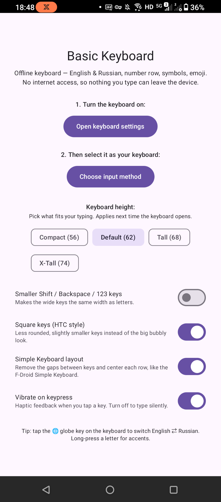
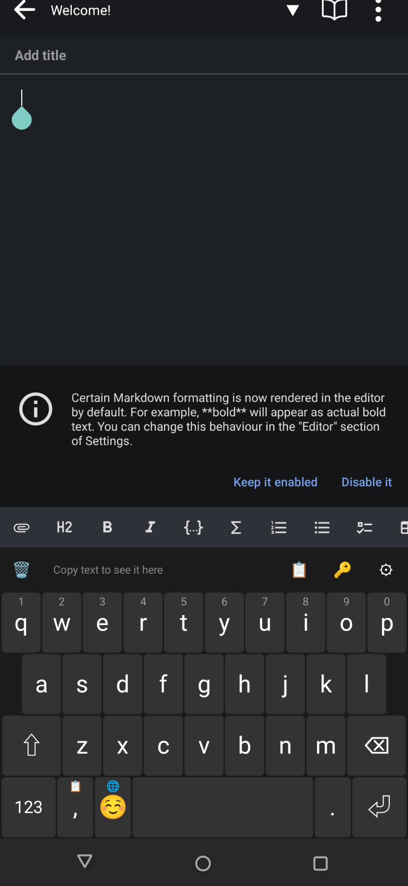
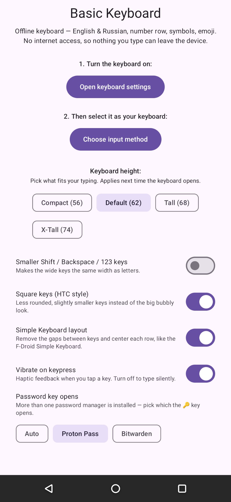

# BasicKeyboard

A minimal **offline keyboard**: English & Russian, drawn on a plain Canvas, no internet.

> Part of the [Basic Apps suite](../README.md). No `INTERNET` permission, so nothing you type can leave the device.

## Screenshots

| Setup | Typing | Password key |
|---|---|---|
|  |  |  |

## Features

- **English + Russian** layouts (tap the 🌐 globe to switch), number row, two symbol pages, emoji panel
- **Long-press** for accents and numbers; **multi-touch key rollover** so fast typing never drops a key
- **Held backspace** accelerates and switches to whole-word deletes
- **Clipboard strip** with history that **ignores sensitive clips** (passwords/OTPs flagged `EXTRA_IS_SENSITIVE`), plus a Proton Pass shortcut
- Adjustable **row height**, **square-key** and **compact-grid** styles, a **vibration** toggle, and automatic dark/light theming

## Notable implementation

- Built on `InputMethodService` with a custom Canvas-drawn key grid (no per-key child views)
- Per-`pointerId` touch model for reliable rollover and multi-finger input
- `onComputeInsets` forces a full-frame touchable region, a fix for host apps whose layout otherwise leaves the visible keys unresponsive
- Fully offline by design: the missing `INTERNET` permission is the privacy guarantee

## Requirements

Enable under **Settings → Languages & input**, then select it as the active keyboard. `minSdk 26`.

**Password key:** the 🔑 opens an installed supported manager (Proton Pass, Bitwarden, KeePassDX, 1Password, and more). The keyboard itself runs on Android 8+, but the popular managers (Proton Pass, Bitwarden) require a newer Android than 8 to install, so on very old devices there may be none to open and the shortcut won't be useful.
