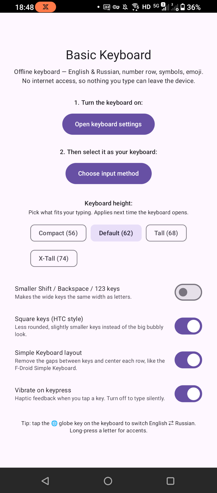
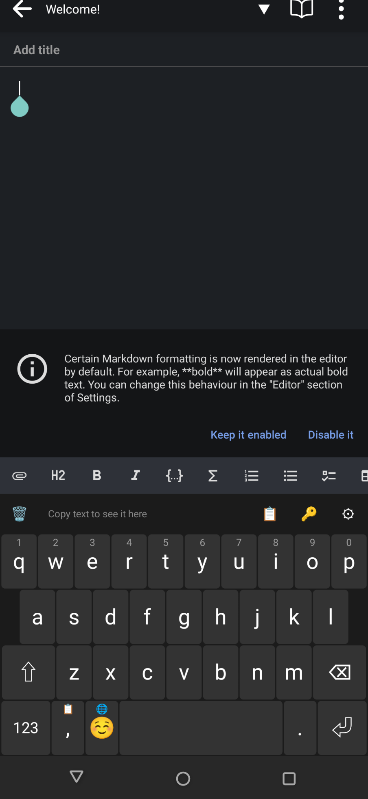
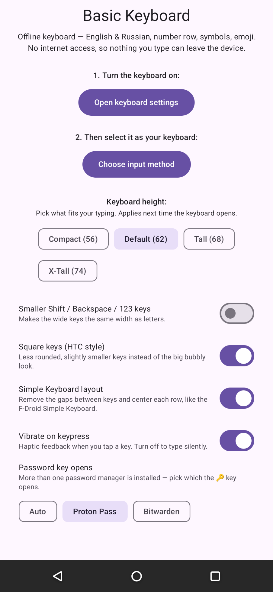

# BasicKeyboard

A minimal **offline keyboard**: English, Russian, Chinese, Japanese and Korean, drawn on a plain Canvas, no internet.

> Part of the [Basic Apps suite](../README.md). No `INTERNET` permission, so nothing you type can leave the device.

## Screenshots

| Setup | Typing | Password key |
|---|---|---|
|  |  |  |

## Features

- **English, Russian, Chinese (pinyin), Japanese (hiragana + katakana), and Korean (Hangul)** layouts (long-press the 🌐 globe for a picker so any mode is one tap away; the space bar names the active script), number row, two symbol pages, emoji panel
- **Every mode is a real IME subtype**, so the system knows about it and switching either way (the app's picker or the system's own input-language switcher) keeps the other in step. Note that Android *implicitly* enables only the subtypes matching your phone's system languages, so on a Chinese ROM you get English and Chinese and the others stay hidden from the system switcher until you turn them on; the setup screen's **Enable input languages** button opens the screen that does it. The 🌐 globe key inside the keyboard reaches all of them regardless
- **Chinese pinyin input**: type toneless pinyin and pick a character or phrase from the candidates bar. Space takes the top candidate, enter types the raw pinyin instead, and shift still types plain latin letters without leaving Chinese mode. Picking a word consumes only its own syllables, so typing `nihaoma` and choosing 你好 leaves `ma` still composing. Conversion is a bundled dictionary, so it works entirely offline like everything else here
- **Japanese kana input**: type romaji and it converts as you go, with separate **hiragana** and **katakana** modes (`sakura` → さくら, `tta` → った, `kanji` → かんじ, `nn` → ん), and 、。 on the comma/period keys. This needs no dictionary at all, the mapping is exact. **Kanji conversion is deliberately not included**: it needs morphological analysis plus a trained language model, and a hand-rolled version would write visibly wrong Japanese, so kana-only is the honest scope
- **Korean Hangul input** on the standard 2-set (두벌식) layout, with shift for the tense consonants (ㅂ → ㅃ). Jamo compose into syllable blocks live in the field as you type (ㅎ → 하 → 한 → 한글), and backspace peels a block apart one keypress at a time instead of deleting the whole syllable. This needs no dictionary either: a Hangul block is arithmetic, not a lookup, so the conversion is exact and can never rank a wrong answer first. Hanja (Chinese characters) are not offered, but unlike the missing kanji above that is barely a limitation: modern Korean is written in Hangul, so this types everyday Korean completely
- **Number pad** shown automatically for numeric, date/time, and phone fields: just the digits plus the separators those need (`: - .` for times/dates, `+ * #` on the dial pad), with an ABC key back to letters
- **Long-press** for accents and numbers, plus multi-touch key rollover so fast typing never drops a key
- **Held backspace** accelerates and switches to whole-word deletes
- **Clipboard strip** with history that ignores sensitive clips (passwords/OTPs flagged `EXTRA_IS_SENSITIVE`), plus a password-manager shortcut
- **Adjustable layout**: row height, square-key and compact-grid styles, a vibration toggle, and automatic dark/light theming

## Notable implementation

- Built on `InputMethodService` with a custom Canvas-drawn key grid (no per-key child views)
- The mode list exists twice by necessity, as the `Lang` enum and as `<subtype>` entries in `res/xml/method.xml`, since the system can only learn about input languages from the manifest resource. They are tied together by each subtype's `mode=` extra value and kept in sync in both directions (`onCurrentInputMethodSubtypeChanged` inbound, `switchInputMethod` outbound), and a unit test fails if one side gains a mode the other lacks
- Per-`pointerId` touch model for reliable rollover and multi-finger input
- `onComputeInsets` forces a full-frame touchable region, a fix for host apps whose layout otherwise leaves the visible keys unresponsive
- Pinyin conversion is a self-contained lookup engine (`PinyinEngine`): the typed letters are the dictionary key, so it needs no grammar or statistical model, only segmentation-free exact matching, frequency-ranked prefix prediction, and a longest-prefix fallback. The in-progress pinyin is a real composing region (`setComposingText`), so it shows underlined in the target field and converts in place
- Kana conversion (`KanaEngine`) is a pure table with three special cases the naive version gets wrong: the sokuon from a doubled consonant, syllabic ん before a consonant, and incomplete tails that must wait for their vowel. Katakana is derived from the hiragana table by the fixed Unicode offset, so there is one table to keep correct rather than two
- Hangul composition (`HangulEngine`) is a small automaton over `0xAC00 + (initial * 21 + medial) * 28 + final`, which is the whole conversion, so there is no data file. It handles the three cases a naive version gets wrong: compound medials (ㅗ + ㅏ is the single vowel ㅘ), compound finals (ㅂ + ㅅ is ㅄ), and the final detaching when a vowel follows it, so ㅎㅏㄴ + ㅣ is 하니 rather than 한ㅣ. Only the last block stays in the composing region, since once a following block starts the previous one can no longer change
- Fully offline by design: the missing `INTERNET` permission is the privacy guarantee

## Pinyin dictionary

Conversion is only as good as the bundled dictionary, `app/src/main/assets/pinyin_dict.txt`, one
entry per line as `<pinyin> <word> <frequency>`, where pinyin is the concatenated toneless
syllables (`nihao`) and ü is written `v`. Higher frequency ranks first.

The shipped file is a small hand-written **seed** (a few hundred common characters and phrases).
It is enough for everyday phrases and to see the whole input path working, but it will miss plenty.
For real vocabulary, convert an open dataset over it:

```bash
python3 tools/make_pinyin_dict.py luna_pinyin.dict.yaml > app/src/main/assets/pinyin_dict.txt
```

The converter accepts RIME dictionaries, mozillazg's pinyin-data / phrase-pinyin-data, or an
already-converted file; it strips tone marks, maps ü to `v`, and merges duplicates keeping the
highest frequency. Keep the source data GPLv3-compatible, since this suite is GPL v3 (RIME dicts
are GPL-3, pinyin-data is MIT, CC-CEDICT is CC BY-SA 4.0). The APK grows by roughly the size of
whatever dictionary you ship.

## Requirements

Enable under Settings → Languages & input, then select it as the active keyboard. `minSdk 26`.

**Password key:** the 🔑 opens an installed supported manager (Proton Pass, Bitwarden, KeePassDX, 1Password, and more). The keyboard itself runs on Android 8+, but the popular managers (Proton Pass, Bitwarden) require a newer Android than 8 to install, so on very old devices there may be none to open and the shortcut won't be useful.
