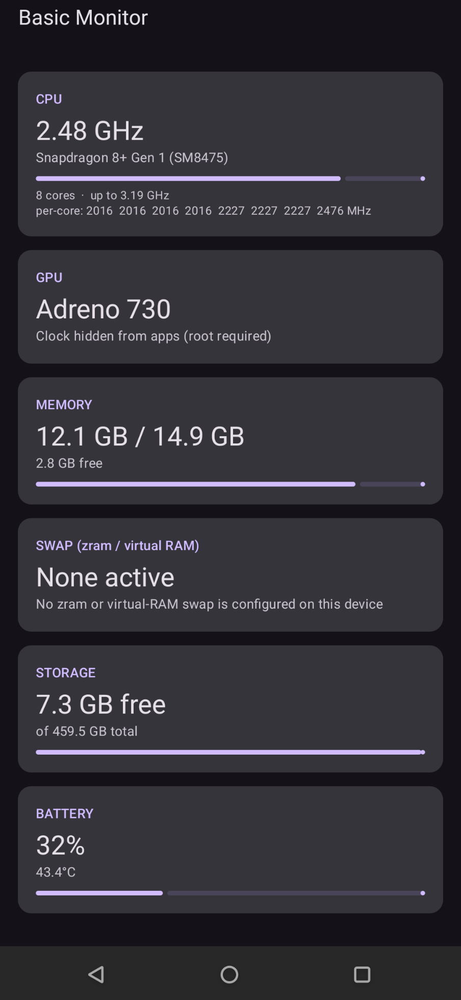
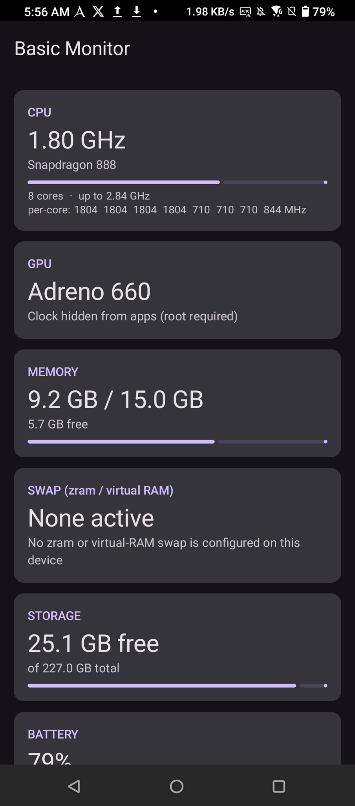

# BasicMonitor

A minimal, zero-permission **system monitor**, a portable, offline stand-in for gaming-phone dashboards like ASUS Armoury Crate.

> Part of the [Basic Apps suite](../README.md). No permissions at all; every stat comes from a public API or a world-readable file. No `INTERNET`.

## Screenshots

| Snapdragon 8+ Gen 1 (ROG Phone 6) | Snapdragon 888 (ROG Phone 5) |
|---|---|
|  |  |

> The same zero-permission APK on two devices; note the CPU/GPU model fallbacks resolve correctly on each.

## Features

Live dashboard (refreshes ~1×/second):

- **CPU**: model (e.g. "Snapdragon 8+ Gen 1"), current top clock, per-core MHz, core count
- **GPU**: model via OpenGL (e.g. "Adreno 730"); clock shown when the kernel exposes it, else an honest "hidden (root required)"
- **Memory**: used / total + free
- **Swap**: combined zram / virtual-RAM usage (or "None active")
- **Storage**: free / total
- **Battery**: level, temperature, charging state

## Notable implementation

- **Reads only what a non-root app truly can**, and degrades honestly where the OS locks things down:
  - CPU clock from `/sys/.../cpufreq/scaling_cur_freq`; CPU model from `Build.SOC_MODEL` (12+) with `/proc/cpuinfo` + board-codename fallbacks
  - GPU model from a 1×1 offscreen EGL context reading `GL_RENDERER`; GPU clock is usually SELinux-blocked, and the app says so rather than faking it
  - RAM/swap from `ActivityManager` + `/proc/meminfo`, storage from `StatFs`, battery from `BatteryManager`
- Portable where OEM tools aren't: because it needs no vendor hooks, the same APK runs on any phone from Android 8 (API 26) up

## Requirements

`minSdk 26`. **No permissions.**
