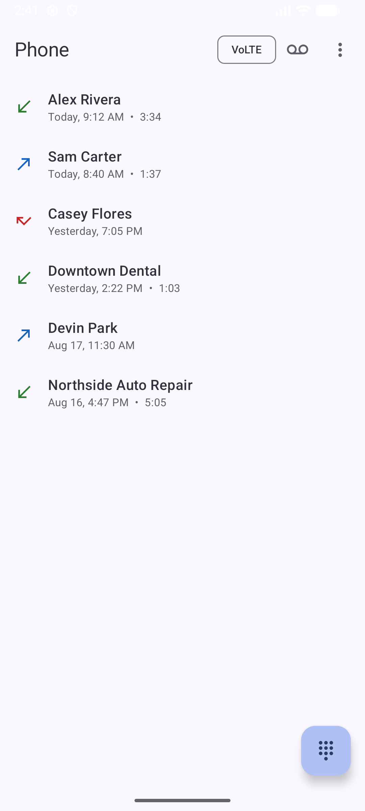
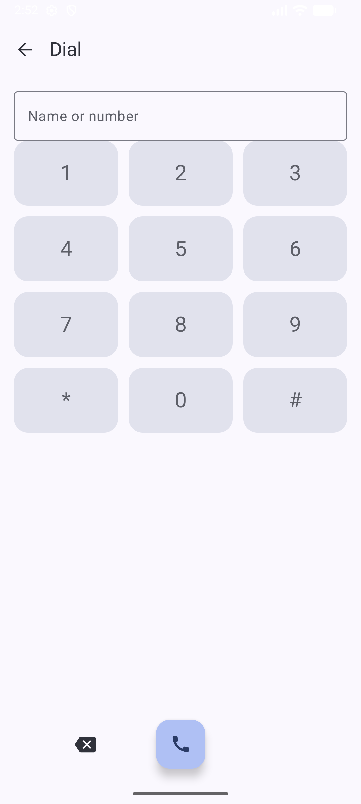

# BasicPhone

A minimal **default dialer / phone app**: call log, in-call UI, and spam screening, fully offline.

> Part of the [Basic Apps suite](../README.md). No `INTERNET` permission.

## Screenshots

| Call log | Dial pad |
|---|---|
|  |  |

> Demo data, fictional 555-01xx numbers and contacts, captured on an emulator.

## Features

- **Call log**: live-updating (Paging 3 + `ContentObserver`), with contact names, call types, durations, and an offline spam hint for repeated/hidden unknowns
- **In-call screen**: mute, speaker, Bluetooth call-audio routing (auto-routes to a connected car), an in-call DTMF keypad, and one-tap "send voicemail PIN"
- **STIR/SHAKEN spam screening** (`CallScreeningService`): silence or reject calls that fail carrier attestation; opt-in, all on-device, no number lists
- **Voicemail**: per-SIM saved number + PIN with DTMF auto-send, sidestepping the phone's broken voicemail setting
- **Multi-SIM**, VoLTE indicator, full-screen incoming-call notification (`CallStyle`), automatic missed-call-count clearing
- **Offline number lookup**: long-press a call to search it (Google or DuckDuckGo) or copy the number

## Notable implementation

- Implements the default-dialer role via `InCallService` + `TelecomManager`
- Missed-call notifications are cleared through `TelecomManager.cancelMissedCallsNotification()`, the platform, not the app, owns that count
- API-guarded across Android 8-15 (`CallStyle`, `POST_NOTIFICATIONS`, `callerNumberVerificationStatus`)

## Requirements

Set as the default phone app. `minSdk 26`. Key permissions: `CALL_PHONE`, `READ_CALL_LOG`, `READ_PHONE_STATE/NUMBERS`, `READ_CONTACTS`, `USE_FULL_SCREEN_INTENT`, `POST_NOTIFICATIONS` (13+).
