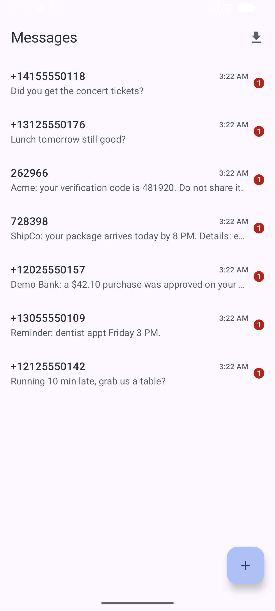
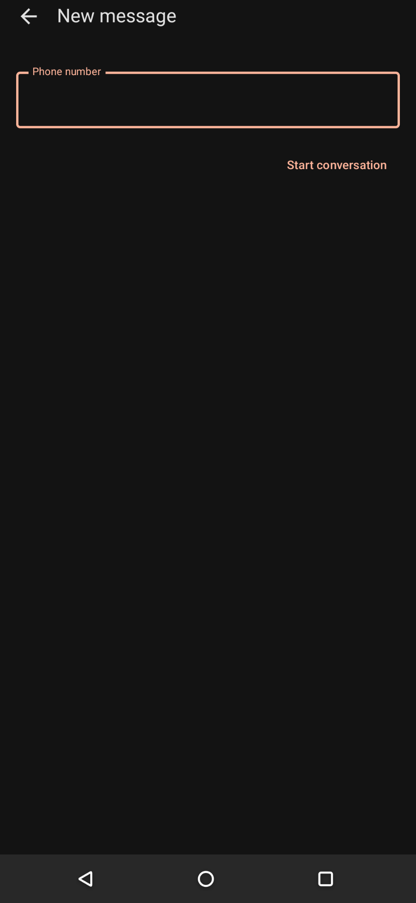

# BasicSms

A minimal **default SMS/MMS app** with reliable background receipt, fully offline.

> Part of the [Basic Apps suite](../README.md). No `INTERNET` permission.

## Screenshots

| Conversations | New message |
|---|---|
|  |  |

> Demo data, fictional 555-01xx numbers, captured on an emulator.

## Features

- **Conversation list & threads**: streamed with Paging 3, contact-name resolution, unread badges
- **Reliable background receipt**: a manifest `SMS_DELIVER` receiver that wakes even when the app was killed, with the notification posted before storage so a login code is never lost to a failed write
- **Multi-SIM send** with a SIM picker; MMS image display
- **Backup import**: restore from an "SMS Import / Export" `.zip`
- **Notifications**: per-conversation, cleared automatically when you read the thread; a banner warns if notifications are switched off
- **Copy** any message's text (handy for OTP codes)

## Notable implementation

- Holds the default-SMS role; reads the live UI straight from the system provider so messages survive reinstalls, with Room kept for backup import
- Self-heals the CN-ROM "default-SMS setting drift" that can silently stop incoming texts
- Foreground-gated mark-as-read via `repeatOnLifecycle(RESUMED)` so a message arriving while backgrounded keeps its notification
- `POST_NOTIFICATIONS` correctly guarded so notifications work on Android 11-15 alike

## Requirements

Set as the default SMS app. `minSdk 26`. Key permissions: `SEND_SMS`, `RECEIVE_SMS`, `READ_SMS`, `RECEIVE_MMS`, `RECEIVE_WAP_PUSH`, `READ_CONTACTS`, `READ_PHONE_STATE`, `POST_NOTIFICATIONS` (13+).
